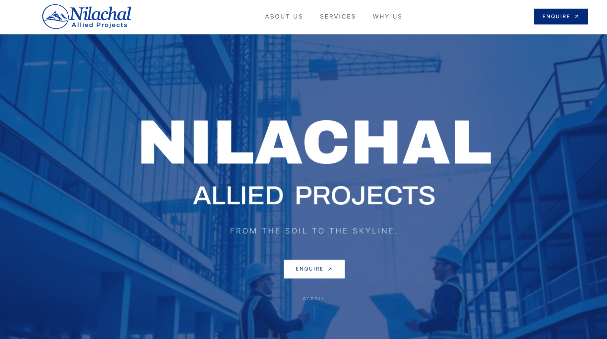
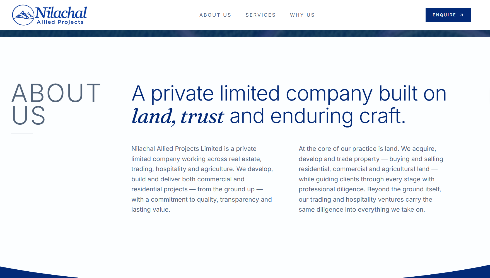

# Nilachal Allied Projects

Marketing site for **Nilachal Allied Projects Limited** — a private limited company working across real estate, trading, hospitality and agriculture, based in Silchar, Assam.





## Stack

React 19 · TypeScript · TanStack Start · Tailwind CSS v4 · Vite

## Development

```bash
npm install
npm run dev      # http://localhost:3000
```

| Command           | Description                  |
| ----------------- | ---------------------------- |
| `npm run dev`     | Dev server                   |
| `npm run build`   | Production build             |
| `npm run preview` | Preview the production build |
| `npm run lint`    | ESLint                       |
| `npm run format`  | Prettier                     |

## Structure

```
src/
  routes/       # __root.tsx layout + index.tsx (single landing page)
  components/   # sections, hero, scroll effects, enquiry form
  lib/          # helpers
  styles.css    # Tailwind theme tokens
public/         # static assets, og-image, sitemap, robots.txt
```

## Deployment

Deployed on Vercel from `main`. Pushes to `main` trigger a build automatically.
